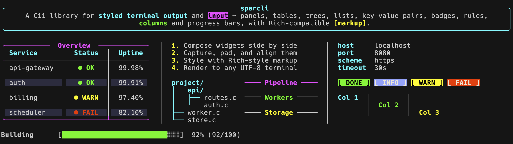
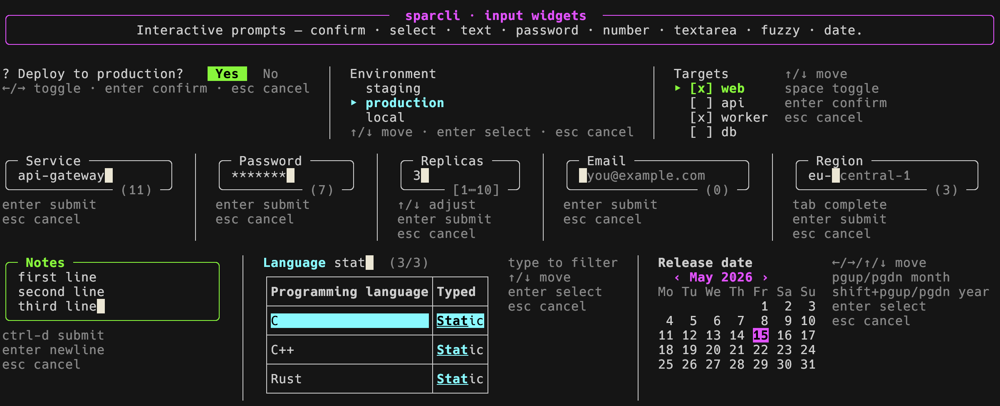
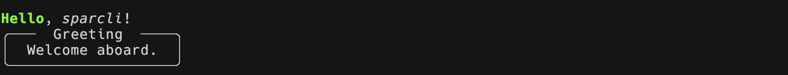
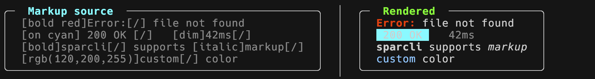

# sparcli – Polished CLI output & prompts

A C11 library for **styled terminal output** and **interactive prompts**:

- panels, tables, rules, columns, lists, trees, key/value blocks, alerts, badges, progress bars and spinners;
- confirm, text, password, number, textarea, select, fuzzy and date-picker prompts.

Ships with **Rich-compatible inline markup**, a header-only **C++ wrapper**, safe, idiomatic **Rust** and **Python** bindings, and a **`sparcli` command-line tool** that exposes everything to the shell (zsh/bash) – think [rich-cli](https://github.com/Textualize/rich-cli) and [gum](https://github.com/charmbracelet/gum) in one binary.

  



---



---

## Table of contents

- [sparcli – Polished CLI output \& prompts](#sparcli--polished-cli-output--prompts)
  - [Table of contents](#table-of-contents)
  - [Features](#features)
  - [Quick start](#quick-start)
    - [C](#c)
    - [C++ (header-only)](#c-header-only)
    - [Rust](#rust)
    - [Python](#python)
  - [Installation](#installation)
    - [From source](#from-source)
    - [Linking](#linking)
    - [Requirements](#requirements)
  - [Output widgets](#output-widgets)
  - [Input widgets](#input-widgets)
  - [Command-line tool](#command-line-tool)
  - [Rich-compatible markup](#rich-compatible-markup)
  - [Development](#development)
  - [Roadmap](#roadmap)
  - [Inspiration](#inspiration)
  - [License](#license)

---

## Features

- **Large set of widgets**: panels, tables, rules, side-by-side columns, lists, trees, key/value blocks, alerts, badges, progress bars, spinners.
- **Interactive prompts**: confirm, text/password, number, textarea, single & multi select, fuzzy finder, and a date picker – each with a non-TTY fallback.
- **Custom key shortcuts** on every prompt (Ctrl-letter / F1–F12 / Alt) bound to return-an-action or live callbacks, plus **rich prompts** (mix styles, e.g. a partly-italic label) – see [Input widgets](#input-widgets).
- **Rich-compatible markup**: `[bold red]error[/]`, `[on cyan] OK [/]`, `[rgb(120,200,255)]…[/]` – same syntax as [Rich](https://github.com/Textualize/rich)/[Textual](https://github.com/Textualize/textual).
- **Clickable hyperlinks (OSC-8)**: `[link=https://…]text[/link]` markup or `sc_text_append_link()` – Cmd/Ctrl+click opens the URL in supporting terminals, plain text everywhere else.
- **Truecolor + 8-color ANSI**, with graceful sentinels for "no color".
- **UTF-8 & ANSI-aware** width math everywhere (codepoints, not bytes).
- **ANSI-injection safe by default**: control bytes and escape sequences in user strings are stripped at the API boundary; opt back in globally (`sc_set_allow_ansi`) or per widget (`.ansi = SC_ANSI_MODE_ALLOW`) with widths staying correct.
- **Composable**: capture any widget into a buffer, then pad, align, or place it inside a columns layout.
- **CLI application helpers**: pipe long output through a pager (`$PAGER`/`less`, auto-skipped in scripts), resolve XDG config/data/cache/state directories (`sc_path_config("myapp")` → `~/.config/myapp`, created on first use), and report fatal errors as pretty panels (`sc_die`: message + cause chain + hint + exit code).
- **Command-line tool included**: the `sparcli` binary brings every output and input widget to the shell – `sparcli panel`, `name=$(sparcli input "Name:")`, `sparcli confirm && …`. See [Command-line tool](#command-line-tool) and [`docs/cli.md`](docs/cli.md).
- **C++ wrapper included**: a header-only RAII C++20 layer (`<sparcli.hpp>`, namespace `sparcli`) – no manual `free`, owned strings, `std::optional` inputs.
- **Rust bindings included**: a safe, idiomatic crate (`bindings/rust/`, builds the C via `cc` – no install needed) with RAII handles, builder options and `Result<Option<T>>` prompts. See [`docs/api-rust.md`](docs/api-rust.md).
- **Python bindings included**: a safe, Pythonic package (`bindings/python/`, a cffi wrapper that compiles the C – no install needed) with RAII handles, `@dataclass` options and `value`/`None` prompts. See [`docs/api-python.md`](docs/api-python.md).
- **FFI-ready**: `extern "C"`, hidden symbol visibility, opaque types, NULL-safe entry points – the C++, Rust and Python wrappers build on this.
- **No runtime dependencies** beyond libc.
- **Static + shared library**, `pkg-config` file, optional ASan/UBSan build.

---

## Quick start

### C

```c
#include <sparcli.h>

int main(void) {
    sc_markup_println("[bold green]Hello[/], [italic]sparcli[/]!");

    ScPanelOpts opts = {
        .border  = { .type = SC_BORDER_ROUNDED },
        .title   = { .text = " Greeting ", .halign = SC_ALIGN_CENTER },
        .padding = { 0, 2, 0, 2 },
    };
    sc_panel_str("Welcome aboard.", opts);
    return 0;
}
```

```sh
cc hello.c $(pkg-config --cflags --libs sparcli) -o hello && ./hello
```



### C++ (header-only)

A header-only C++20 wrapper ships in [`include/sparcli.hpp`](include/sparcli.hpp): RAII handles (no manual `free`), owned strings where the C API borrows (so temporaries are safe), and `std::optional` returns for input prompts. Full reference: [`docs/api-cpp.md`](docs/api-cpp.md).

```cpp
#include <sparcli.hpp>
using namespace sparcli;

int main() {
    panel("Welcome aboard.", { .border = { .type = SC_BORDER_ROUNDED },
                               .title  = { .text = " Greeting ",
                                           .halign = SC_ALIGN_CENTER } });
    Table t;                                   // frees itself
    t.add_column("Name");
    t.add_row({ "Ada", std::to_string(42) });  // strings are owned → safe
    t.print({ .header = { .row = true } });

    if (auto name = text_input("Your name"))   // std::optional<std::string>
        markup::println("[green]Hi[/] " + *name);
}
```

```sh
c++ -std=c++20 hello.cpp $(pkg-config --cflags --libs sparcli) -o hello
```

**Why the wrapper?** Two easy C-API mistakes simply can't happen with it:

```cpp
// C API – two footguns:
ScTableData *t = sc_table_new();                      // 1) leaks if you forget
                                                      //    sc_table_free(t)
sc_table_add_row(t, (ScCell[]){                       // 2) the table BORROWS the
    sc_cell(std::to_string(n).c_str()) }, 1);         //    string; the temporary
                                                      //    dies here → dangling
sc_table_print(t, (ScTableOpts){0});                  //    pointer read → garbage

// C++ wrapper – RAII frees, and the cell string is copied into the table:
sparcli::Table t;                                     // frees itself
t.add_row({ std::to_string(n) });                     // owned → temporary is safe
t.print();
```

These guarantees (auto-free, owned cell strings, surviving a move) are verified by [`tests/cpp/test_cpp.cpp`](tests/cpp/test_cpp.cpp).

### Rust

Safe, idiomatic bindings live in [`bindings/rust/`](bindings/rust/) (a cargo workspace). `sparcli-sys` compiles the C with the `cc` crate, so a plain `cargo build` needs only a Rust toolchain – no prior `make` or install. RAII handles free themselves, `*Opts` use builder methods, callbacks are closures, and prompts return `Result<Option<T>>` (`Ok(None)` = cancelled). Full reference: [`docs/api-rust.md`](docs/api-rust.md).

```rust
use sparcli::*;

fn main() -> sparcli::Result<()> {
    panel("Welcome aboard.", PanelOpts::new().rounded().title("Greeting"));

    let mut t = Table::new();                  // frees itself
    t.column("Name", ColOpts::new());
    t.row(["Ada", "42"]);                      // strings owned → temporaries safe
    t.print(TableOpts::new().header_row(true));

    if let Some(name) = text_input("Your name", TextInputOpts::new())? {
        markup::println(&format!("[green]Hi[/] {name}"));
    }
    Ok(())
}
```

```sh
# the workspace has no bin, so run an example (from bindings/rust/):
cargo run -p sparcli --example demo          # complete showcase: all widgets
```

### Python

Pythonic bindings live in [`bindings/python/`](bindings/python/) – a **cffi** (API-mode) wrapper that compiles the C sources into an extension, so building needs only a C compiler. RAII handles free themselves, options are `@dataclass`es with keyword args, and prompts return the value or `None` on cancel (and raise `SparcliInputUnavailable` with no TTY). Full reference: [`docs/api-python.md`](docs/api-python.md).

```python
import sparcli as sc

sc.panel("Welcome aboard.", sc.PanelOpts(title="Greeting",
         border=sc.BorderStyle(sc.BorderType.ROUNDED)))

t = sc.Table()                                 # frees itself
t.column("Name").column("Age", sc.ColOpts(halign=sc.Align.RIGHT))
t.row(["Ada", "42"])
t.print(sc.TableOpts(header_row=True))

name = sc.text_input("Your name")              # str, or None if cancelled
if name:
    sc.markup.println(f"[green]Hi[/] {name}")
```

```sh
make python                                    # build the extension in place
PYTHONPATH=bindings/python/src python bindings/python/examples/demo.py  # all widgets
```

---

## Installation

### From source

```sh
git clone https://github.com/cgroening/c-sparcli.git
cd c-sparcli
make                          # builds libsparcli.a, the shared lib, and sparcli.pc
sudo make install             # installs into /usr/local
# or, install into a user prefix:
make install PREFIX=$HOME/.local
```

`make install` lays down:

- `libsparcli.a` (static)
- `libsparcli.<version>.dylib` / `libsparcli.so.<version>` plus the usual versioned symlinks (`libsparcli.dylib` / `libsparcli.so`)
- All public headers under `<prefix>/include`
- `sparcli.pc` under `<prefix>/lib/pkgconfig`

### Linking

With `pkg-config` (recommended):

```sh
cc app.c $(pkg-config --cflags --libs sparcli) -o app
```

Manual:

```sh
cc app.c -I<prefix>/include -L<prefix>/lib -lsparcli -o app
```

### Requirements

- C11 compiler (`cc`, `gcc`, or `clang`)
- A UTF-8-capable terminal
- Truecolor support recommended for `[rgb(…)]` markup; 8-color ANSI works everywhere

---

## Output widgets

A one-line summary per widget. The full reference – every type, every option, every macro – lives in [`docs/api-c.md`](docs/api-c.md).

| Widget | Function family | What it does |
|--------|----------------|--------------|
| **Panel** | `sc_panel_*` | Bordered frame with title, padding, margin, optional background. |
| **Table** | `sc_table_*` | Headers, footers, colspan, rowspan, striping, word-wrap, per-column widths and styles. |
| **Rule** | `sc_rule_*` | Horizontal line with optional centered/aligned title. |
| **Columns** | `sc_columns_*` | Side-by-side layout for any other widgets (with optional separator). |
| **List** | `sc_list_*` | Bulleted, numbered, alpha, or roman lists with hanging indent and nesting. |
| **Tree** | `sc_tree_*` | Hierarchical tree view with connectors. |
| **Key/Value** | `sc_kv_*` | Aligned `key: value` pairs with key-column padding and optional value wrap. |
| **Alert** | `sc_alert_*` | Preset info / warning / error / success boxes (icon + color). |
| **Badge** | `sc_badge_*` | Inline styled token (`[ DONE ]`). |
| **Progress bar** | `sc_progressbar_*` | Animated progress bar with thresholds and percent/value display. |
| **Spinner** | `sc_spinner_*` | Animated activity indicator with success/failure finish. |
| **Markup** | `sc_markup_*` | Rich-compatible `[bold red]…[/]` parser. |
| **Capture** | `sc_capture_*`, `sc_vstack` | Render any widget into a reusable in-memory buffer; `sc_vstack` stacks several buffers into one column. |
| **Pad** | `sc_pad_*` | Add top/right/bottom/left space around a rendered widget. |
| **Align** | `sc_align_*` | Center- or right-align a rendered widget within a width. |

---

## Input widgets

Interactive prompts that drive a real terminal in raw mode. Each returns an `ScInputStatus` – Esc and Ctrl-C cancel, and a non-TTY context (output piped, CI) returns an error so callers can fall back to a default. The full reference lives in [`docs/api-c.md`](docs/api-c.md#input-widgets).

| Widget | Function family | What it does |
|--------|----------------|--------------|
| **Confirm** | `sc_confirm` | Yes/No prompt; arrow / `y` / `n` selection. |
| **Text input** | `sc_text_input` | Single-line entry with placeholder, validation, autocomplete, char filters, optional boxed panel. |
| **Password** | `sc_password_input` | Masked single-line entry (configurable mask glyph). |
| **Number** | `sc_number_input` | Numeric entry with min/max/step, ↑/↓ adjustment, comma/period decimal separator and exact-text output (decimal-type safe). |
| **Textarea** | `sc_textarea` | Multi-line entry (Ctrl-D submits) with soft-wrap. |
| **Select** | `sc_select_*` | Single- or multi-choice list with a scrolling viewport. |
| **Fuzzy finder** | `sc_fuzzy_*` | Incremental fuzzy search; optional table view. |
| **Date picker** | `sc_datepicker` | Month-grid calendar; day/week/month/year navigation. |
| **Theme** | `sc_input_set_theme` | Process-wide style defaults inherited by every input widget. |

Every widget shows a key-hint footer that is fully configurable: its layout (`hint_layout` – inline, stacked one-per-line, or hidden) and its placement (`hint_pos` – above, below, left, or right of the widget).

```c
char *name = NULL;
if (sc_text_input("Your name", &name, (ScTextInputOpts){ .placeholder = "Ada" })
        == SC_INPUT_OK) {
    sc_markup_println("[green]Hello[/], it's nice to meet you.");
    free(name);
}
```

**Custom shortcuts** – bind extra keys (Ctrl-letter, F1–F12, Alt) to actions on *any* widget via its opts. A `SC_SHORTCUT_RETURN` shortcut closes the prompt and reports which key fired (the widget still returns its value); a `SC_SHORTCUT_CALLBACK` runs in place and keeps the prompt open – handy with `sc_select_remove` / `sc_select_set_label` for live list editing. Labeled shortcuts appear in a dim footer automatically.

**Rich prompts** – for partial styling (e.g. `Rename `*`Apple`*` to`) set `prompt_markup = true` to parse the prompt as markup, or `prompt_text` to pass a pre-built multi-style `ScText`. Works inline and in boxed mode.

**External editor** – `sc_text_input` / `sc_textarea` can open the value in `$EDITOR` (default chain ending in nvim) with `external_editor = true`; a key (default Ctrl-G) suspends the prompt, and save+quit brings the text back. Runs shell-free with a `0600` temp file; not available for passwords.

Build a runnable demo of every input widget with [`examples/input_demo.c`](examples/input_demo.c), or the shortcuts + rich-prompt demo ([`examples/shortcut_demo.c`](examples/shortcut_demo.c) – F2 renames, Ctrl-X deletes):

```sh
make run-example EX=input_demo
make run-example EX=shortcut_demo
```

---

## Command-line tool

Everything above is also available from the shell: `make` builds a `sparcli` binary (installed to `$(PREFIX)/bin` by `make install`, together with a zsh completion) that wraps every output and input widget as a subcommand – inspired by [rich-cli](https://github.com/Textualize/rich-cli) for output and [gum](https://github.com/charmbracelet/gum) for prompts.

```sh
# Output: markup, panels, rules, tables, trees, alerts, ...
sparcli print "[bold red]Error:[/] file not found"
echo "All systems operational" | sparcli panel --title "Status" --color green
df -h | tr -s ' ' '\t' | sparcli table --tsv --header-row
sparcli alert success "Deployment finished"
sparcli spin --title "Building" -- make all

# Input: prompts whose UI goes to the terminal, the value to stdout -
# perfect for command substitution and exit-code logic in scripts.
name=$(sparcli input "Your name:")
sparcli confirm "Deploy to production?" && ./deploy.sh
branch=$(git branch --format='%(refname:short)' | sparcli select)
file=$(find . -name '*.c' | sparcli fuzzy)
amount=$(sparcli number "Amount:" --decimals 2 --decimal-sep ,)
when=$(sparcli date --format %Y-%m-%d)
```

Input commands report their outcome through the exit code (`0` = confirmed, `1` = cancelled/no, `2` = error or no TTY), so `&&` / `||` chains and `$(...)` capture work the way shell scripts expect. Markup is parsed everywhere by default (`--no-markup` for literal text); `--no-color` / `NO_COLOR` strip the colors.

Two runnable zsh demos ship in [`examples/cli_output_demo.zsh`](examples/cli_output_demo.zsh) and [`examples/cli_input_demo.zsh`](examples/cli_input_demo.zsh). The full reference – every subcommand, flag, data format and scripting pattern – lives in [`docs/cli.md`](docs/cli.md).

---

## Rich-compatible markup

sparcli's inline markup mirrors the syntax used by [Rich](https://github.com/Textualize/rich) and [Textual](https://github.com/Textualize/textual). Existing Rich strings drop in unchanged for the supported tag set:

```c
sc_markup_println("[bold red]Error:[/] file not found");
sc_markup_println("[on cyan] 200 OK [/]   [dim]42ms[/]");
sc_markup_println("[rgb(120,200,255)]custom[/] color");
```

| sparcli                  | Rich (Python)            |
|--------------------------|--------------------------|
| `[bold red]…[/]`         | `[bold red]…[/]`         |
| `[on yellow]…[/]`        | `[on yellow]…[/]`        |
| `[underline]…[/u]`       | `[underline]…[/u]`       |
| `[rgb(120,200,255)]…[/]` | `[rgb(120,200,255)]…[/]` |
| `[[`                     | `[[`                     |

By default, unknown tags such as `[blink]` are emitted verbatim. Pass `ScMarkupOpts{ .strip_unknown = 1 }` to silently drop them and keep only the inner content.

Clickable **OSC-8 hyperlinks** use the same syntax as Rich: `[link=https://example.com]text[/link]` (or `sc_text_append_link()` from code). Supporting terminals open the URL on Cmd/Ctrl+click; others show just the text.

Any widget that takes an `ScText *` accepts markup via `sc_markup_parse()`. For tables, use the `SC_CELL_M("…")` macro to embed markup directly into a cell.



---

## Development

```sh
make            # static + shared + pkg-config
make test       # run the full non-interactive test suite (all headless gates)
make test-output # visual output gallery (ARGS=--focus / --no-animated)
make test-input # interactive widget suite (needs a real terminal)
make rust       # build the Rust binding (make rust-test to test it)
make python     # build the Python binding (make python-test to test it)
make rebuild-all # rebuild the C lib + install + Rust + Python in one go
make clean
```

Project layout:

```
include/{core,output,input}/   public headers (sparcli.h is the umbrella)
include/sparcli.hpp            header-only C++20 wrapper
src/{core,output,tty,input}/   implementation
src/output/table/              table sub-modules (see docs/api-c.md)
cli/                           the sparcli command-line tool (see docs/cli.md)
completions/                   zsh completion for the CLI
bindings/rust/                 safe Rust crate (sparcli-sys + sparcli)
bindings/python/               safe Python package (cffi API-mode wrapper)
tests/output/                  output suite
tests/input/{logic,style,pty}/ interactive / snapshot / PTY suites
tests/cli/                     CLI golden-file + PTY suites
docs/                          API reference and developer guide
```

See **[`docs/DEVELOPMENT.md`](docs/DEVELOPMENT.md)** for the full build/test/ install workflow: every `make` target, what each test suite covers and how to run it, the golden-file workflow, and the pre-commit checklist.

---

## Roadmap

- **C++ wrapper** – ✅ ships as the header-only [`include/sparcli.hpp`](include/sparcli.hpp) (RAII over `ScText`/`ScTableData`/`ScColumns`/…; see below).
- **Rust bindings** – ✅ ship in [`bindings/rust/`](bindings/rust/) (the safe `sparcli` crate over `sparcli-sys`; see [`docs/api-rust.md`](docs/api-rust.md)).
- **Python bindings** – ✅ ship in [`bindings/python/`](bindings/python/) (the cffi API-mode `sparcli` package; see [`docs/api-python.md`](docs/api-python.md)).
- **Command-line tool** – ✅ ships as the `sparcli` binary ([`cli/`](cli/); every widget as a shell subcommand with zsh completion; see [`docs/cli.md`](docs/cli.md)).
- **Output theming** – a process-wide `sc_output_set_theme(...)` for output components (default border style/color, title styling, …), mirroring the existing [`sc_input_set_theme`](#input-widgets) for input widgets.
- **`examples/` directory** with self-contained copy-pasteable snippets.
- **More widgets** – open an issue with ideas.

---

## Inspiration

Heavily inspired by the wonderful [Rich](https://github.com/Textualize/rich) and [Textual](https://github.com/Textualize/textual) projects by Will McGugan and the Textualize team. The goal of sparcli is to give plain C programs the same level of polish for one-shot CLI output – without taking on a full TUI runtime.

---

## License

MIT. See [LICENSE](LICENSE) for the full text.
